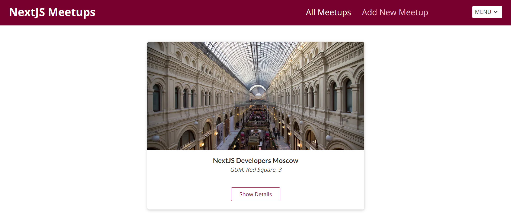

<p align="center">


</p>

# NextJS Meetups

> Site for fine and useful NextJS meetings!👨🏻‍🤝‍👨🏻



Live site: <https://next-js-meetings.vercel.app/>
<br>

### Used technologies

- NextJS
- MongoDB
- Material UI
- Jest and React Testing Library/jest-dom
- Passwordless authentication with Stytch
- React Hook Form(but was сhanged to Formik) library
- CSS Modules and CSS-in-JS(emotion library and styled components, but in production version only css modules)

## Table of Contents

- [Introduction](#nextjS-meetups)
  - [Live site](#nextjS-meetups)
  - [Used technologies](#used-technologies)
- [Overview](#overview)
  - [More about technologies](#more-about-technologies)
  - [Realized Features](#realized-features)
- [Limitations](#limitations)
- [Setup](#quick-setup)
- [Contacts](#contacts)
  <br>

## Overview

### More about technologies

1. Used the following Next JS features:
- Routing
- Image, Head, Link components
- \_document.js to add google fonts
- next.config.js for add permitted domains for images
- environment variables for server and browser(with prefix `NEXT_PUBLIC_`)
- SSR(`getServerSideProps`), ISR(`getStaticProps` with revalidate options), SSG(getStaticProps/`getStaticPaths` + getStaticProps) strategies

  <br>

2. I tried to use CSS-in-JS together with Material UI. But then I changed it to CSS Modules for maintaining the general style of project( i started with CSS modules)

Usage styled components

```javascript
import { styled } from '@mui/material/styles';
const StyledAlert = styled(Alert)(() => ({
width: '100%',
backgroundColor: '#2dbd3e',
fontSize: '1.4rem',
display: 'flex',
alignItems: 'center',
'& svg': {
fontSize: '1.8rem',
},
}));
```  

Usage Emotion library

```javascript
<Modal open={open} onClose={handleClose}>
<Box
sx={{
position: 'absolute',
top: '50%',
left: '50%',
transform: 'translate(-50%, -50%)',
width: 400,
bgcolor: 'background.paper',
border: '2px solid #000',
boxShadow: 24,
p: '2rem 2rem 0.3rem 2rem',
display: 'flex',
justifyContent: 'center',
alignContent: 'center',
flexWrap: 'wrap',
}}
>
<Login />
<Button onClick={onClose} sx={{ marginTop: '1rem', color: '#77002e', fontSize: '1.2rem' }}>Close</Button>
</Box>
</Modal>
```

<br>

3. Created Unit tests with Jest, React Testing Library and jest-dom
 
   <br>

4. Used React Hook Form library firstly. But it turned out not very flexible for my case. That I added Formik in my project.

- add part of my realization with React Hook Form

        import { useForm } from 'react-hook-form';
        import Card from '../card/Card';
        import classes from './NewMeetupForm.module.css';

        function NewMeetupForm(props) {
        const { register, handleSubmit, formState: { errors }, watch } = useForm();
        const watchedFields = watch();

        const validateImageDomain = (value) => {
            const allowedDomains = [
            'cdn.pixabay.com',
            'upload.wikimedia.org'
            ];
            const pattern = new RegExp(^https?://(?:${allowedDomains.join('|')}));

            return pattern.test(value)  'Only images from specific domains are allowed.';
        };

        const onSubmit = (data) => {
            props.onAddMeetup(data);
        };

        return (
            <Card>
            <form className={classes.form} onSubmit={handleSubmit(onSubmit)} noValidate>
                <div className={classes.control}>
                <label htmlFor='title'>Meetup Title</label>
                <input
                    type='text'
                    required
                    id='title'
                    {...register('title', { required: true })}
                    value={watchedFields.title | ''}
                />
                {errors.title && <p>Title is required.</p>}
                </div>
                <div className={classes.control}>
                <label htmlFor='image'>Meetup Image</label>
                <input
                    type='url'
                    required
                    id='image'
                    {...register('image', {
                    required: true,
                    validate: validateImageDomain
                    })}
                    value={watchedFields.image | ''}
                />
                {errors.image && <p>Image URL is required.</p>}
                </div>
                                ...
                                

5. Created custom hooks to:

- work with MongoDB
- check that element is visible on page
- controll showing/closing/approving for Login and Logout Modals
 
  <br>

### Realized features

<br>
1. Realized passwordless authentication with using Stytch service. And added ability to logout.

<br>

> After authorization interface changes.


<br>

2. Created feature that protects against spam by emails.

> If user send sms to one email 3 times without confirmation on email, validation won't permit the 4th time.


<br>

3.  Realized progressive loading for meetups list, when data loads after clicking on the button "Show more"

```javascript
const [showMore, setShowMore] = useState(3);

function handleShowMoreClick() {
setShowMore((prevValue) => prevValue + 3);
}
//make shallowCopy of array and reverse it to show new meetups at first
const showedMeetups = props.meetups.slice().reverse().slice(0, showMore);
```


<br>

4. Implemented components with Material UI

- Snackbar
- Modal Window
- Dropdown menu
- Loading linear
- Alert for confirmation action
 
  <br>

5. Created MongoDB collection. Realized sending data to database after submiting form. And implemented server-side and client-side rendering data from database.
 
   <br>

6. Made validation form. It checks field after touching it and loss of focus. When all inputs are valid, submit button becomes enabled.


   <br>
---
### ⚠Limitations

- Site isn't responsive

## 🚀Quick Setup

1.  Clone this repository:

        git clone https://github.com/DmitriZaytsev/Next-JS-Meetups.git

2.  Install npm packages:

        npm i

3.  Open site in browser:

        npm start

You can replace "npm" with the word "yarn", if you use it.

---

### 💌Contacts

Telegram: [@dmitr1_zaytsev](https://t.me/dmitr1_zaytsev)

Mail: <dmitri_zaytsev@bk.ru>
